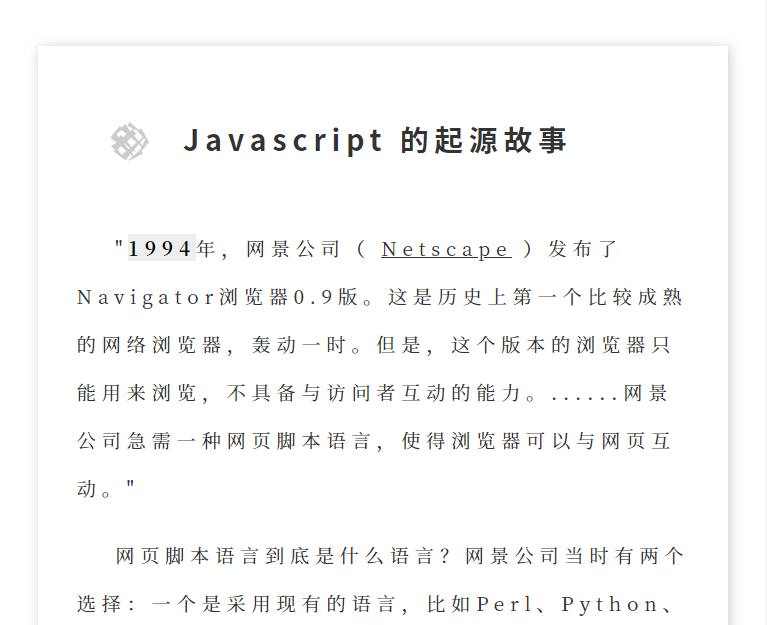
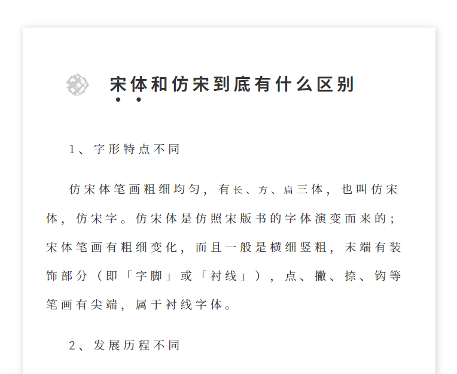

# Typesetting cjk.css
一个好用的文字排版 CSS。
[项目主页](http://typesetting-cjk-css-git-main.baigei-gu.vercel.app/)
[Github主页](https://github.com/Baigei-Gu/Typesetting-cjk.css/)

## Screenshot

 
## Demo
[Demo1](https://typesetting-cjk-css.vercel.app/page/1.html) [Demo2](https://typesetting-cjk-css.vercel.app/page/2.html)
## 贡献
得了丢 Pull Requests 就行了，反正我也不会用 Git （
记得写你整了啥。 